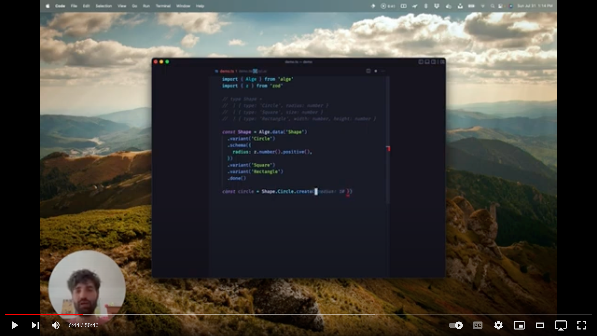

# Alge 🌱

[](https://github.com/jasonkuhrt/alge/actions/workflows/trunk.yml)
[](https://www.npmjs.com/package/alge)

## TL;DR

Type safe fluent API library for creating [Algebraic Data Types](https://en.wikipedia.org/wiki/Algebraic_data_type) (ADTs) in TypeScript. Pronounced "AL GEE" like [the plant](https://en.wikipedia.org/wiki/Algae) ([or whatever it is](https://www.indefenseofplants.com/blog/2018/2/20/are-algae-plants)). Schemas powered by [Zod](https://github.com/colinhacks/zod) <3.

There are three distinct conceptual levels in Alge. Firstly there is a builder for defining your ADT in the first place. Secondly there is a controller for working with your defined ADT such as construction, type guards, and codecs. Finally there are the actual pure-data instances of your ADT.


Here's how it looks like in code. First the Builder which outputs a Controller.

```ts
import { Alge } from '../src/index.js'
import { z } from 'zod'

const Length = z.number().positive()

//           v---------- 2. ADT Controller
//           |            v--------- 1. ADT Builder
export const Shape = Alge.data(`Shape`, {
  Rectangle: {
    width: Length,
    height: Length,
  },
  Circle: {
    radius: Length,
  },
  Rectangle: {
    size: Length,
  },
})
```

Now the Controller:

```ts
//    v--------- 3. Instance
//    |        v--------- 2. ADT Controller
const circle = Shape.Circle.create({ radius: 50 })
// { _tag: 'Circle', radius: 50 }

if (Shape.Circle.is(circle)) {
  console.log(`I Am Circle`)
}

const circleForTheOutsideWorld = Shape.Circle.to.json(circle)
// '{ "_tag": "Circle", "radius": 50 }'

const squareFromTheOutsideWorld = Shape.Square.from.json({ _tag: 'Square', size: 10 })
// { _tag: 'Square', size: 10 }
```

Finally are the instances which you can see above are created by the controller. Instances are just data. They are _not_ like class instances that couple logic and data. All logic related to an ADT, like type guards, resides in the controller.

If you don't need a full blown ADT but just one record, Alge can do that:

```ts
//    v---------- 2. Record Controller
//    |             v--------- 1. Record Builder
const Circle = Alge.record(`Circle`, { radius: Length })
```

If you want to compose your ADT incrementally Alge can do that:

```ts
//    v---------- 2. Record Controller
//    |             v--------- 1. Record Builder
const Circle = Alge.record(`Circle`, { radius: Length })
const Square = Alge.record(`Square`, { size: Length })
//    v---------- 2. ADT Controller
//    |            v--------- 1. ADT Builder
const Shape = Alge.data(`Shape`, {
  Circle,
  Square,
})
```

This is just a taster. Places you can go next:

1. [Install](#installation) and learn interactively (JSDoc is coming soon!)
1. A formal [features breakdown](#features)
1. [Code examples](/examples)
1. A simple [introduction to Algebraic Data Types](#about-algebraic-data-types) (for those unfamiliar)
1. A admittedly rambling 😃 [video introduction](https://youtu.be/fLlVQSJx4AU) if you like that format

   [](https://youtu.be/fLlVQSJx4AU)

## Contents

<!-- toc -->

- [Installation](#installation)
- [Roadmap](#roadmap)
- [About Algebraic Data Types](#about-algebraic-data-types)
  - [What?](#what)
  - [Why?](#why)
- [Features](#features)
  - [Records](#records)
  - [Lone Record](#lone-record)
  - [Lone Record Composition](#lone-record-composition)
  - [Schema](#schema)
    - [Properties](#properties)
    - [Optional Properties](#optional-properties)
    - [Property Defaults](#property-defaults)
  - [Identity](#identity)
  - [Codecs](#codecs)
    - [JSON](#json)
    - [Custom](#custom)
    - [Throw Decoding](#throw-decoding)
    - [ADT Level](#adt-level)
  - [Static Types](#static-types)
    - [Namespaces](#namespaces)

<!-- tocstop -->

## Installation

```
npm add alge
```

## Roadmap

There is no timeline but there are priorities. Refer to the currently three [pinned issues](https://github.com/jasonkuhrt/alge/issues).

## About Algebraic Data Types

Alge is a Type Script library for creating [Algebraic Data Types](https://en.wikipedia.org/wiki/Algebraic_data_type) (ADTs). This guide will take you from not knowing what ADTs are to why you might want to use Alge for them in your code.

### What?

Algebraic Data Types (ADTs for short) are a methodology of modelling data. They could appear in any context that is about defining and/or navigating the shape of data. One of their fundamental benefits is that they can express different states/inrecords/facts about/of data. They are the combination of two other concepts, _product types_ and _union types_.

A product type is like:

```ts
interface Foo {
  bar: string
  qux: number
}
```

A union type is like:

```ts
type Foo = 1 | 2 | 3
```

Basically, when the power of these two data modelling techniques are combined, we get something far greater than the sum of its parts: ADTs.

ADTs can particularly shine at build time. While dynamically typed programing languages ("scripting language", e.g. Ruby, JavaScript, Python, ...) can support ADTs at runtime, adding static type support into the mix increases the ADT value proposition. Then there are yet other more minor programing language features like pattern matching that if supporting ADTs make them feel that much more beneficial too.

References:

- [Wikipedia entry on ADTs](https://en.wikipedia.org/wiki/Algebraic_data_type)
- [Type Script documentation on discriminated unions](https://www.typescriptlang.org/docs/handbook/typescript-in-5-minutes-func.html#discriminated-unions)

### Why?

Now that we have some understanding of _what_ ADTs are let's build some understanding about _why_ we might want to use them. To do this we'll work with an example.

Let's say we want to accept some user input about an npm package dependency version pin. It might come in the form of an exact version or a range of acceptable versions. How would we model this? Let's start without ADTs and then refactor with them to appreciate the difference. Let's assume that input parsing has been taken care of and so here we're only concerned with structured data modelling.

```ts
interface Pin {
  isExact: boolean
  patch?: number
  minor?: number
  major?: number
  release?: string
  build?: string
  range?: Array<{
    operator: `~` | `>=` | `...` // etc.
    patch: number
    minor: number
    major: number
    release?: string
    build?: string
  }>
}
```

This data modelling is flawed. There is out-of-band information about important data relationships. `release` and `build` are legitimately optional properties but `range` `patch` `minor` `major` all depend on the state of `isExact`. When `true` then `range` is undefined and the others are not, and vice-versa. In other words these configurations of the data are impossible:

```ts
const pin = {
  isExact: true,
  patch: 1,
  minor: 2,
  major: 3,
  range: [
    {
      operator: `~`,
      patch: 1,
      minor: 0,
      major: 0,
    },
  ],
}
```

```ts
const pin = {
  isExact: false,
  patch: 1,
  minor: 2,
  major: 3,
}
```

While these are possible:

```ts
const pin = {
  isExact: true,
  patch: 1,
  minor: 2,
  major: 3,
}
```

```ts
const pin = {
  isExact: true,
  patch: 1,
  minor: 2,
  major: 3,
  release: `beta`,
}
```

```ts
const pin = {
  isExact: false,
  range: [
    {
      operator: `~`,
      patch: 1,
      minor: 0,
      major: 0,
    },
  ],
}
```

But since our data modelling doesn't encode these _facts_ our code suffers. For example:

```ts
if (pin.isExact) {
  doSomething(pin.major!)
  //                       ^
}
```

Notice the `!`. Its us telling Type Script that `major` is definitely not undefined and so the type error can be ignored. In JS its even worse, as we wouldn't even be prompted to think about such cases, unless we remember to. Seems trivial in this case, but at scale day after day often with unfamiliar code a mistake will inevitably be made. Another approach could have been this:

```ts
if (pin.isExact) {
  if (!pin.major) throw new Error(`Bad pin data!`)
  doSomething(pin.major)
}
```

So, poor data modelling affects the quality of our code by our code either needing to deal with apparently possible states that are actually impossible OR by our code carefully ignoring those impossible states. Both solutions are terrible because they make code harder to read. There is more code, and the chance that wires about impossible and possible states will cross becomes a real possibility leading to potential runtime errors.

ADTs solve this. Let's refactor our Pin type into an ADT to see how!

```ts
type Pin = ExactPin | RangePin

interface ExactPin {
  tag: `ExactPin`
  patch: number
  minor: number
  major: number
  release?: string
  build?: string
}

interface RangePin {
  tag: `RangePin`
  values: Array<{
    operator: `~` | `>=` | `...` // etc.
    isExact: boolean
    patch: number
    minor: number
    major: number
    release?: string
    build?: string
  }>
}
```

Now we've encoded the possible states we cared about. Our code quality increases:

```ts
if (pin.tag === 'ExactPin') {
  doSomething(pin.major) // No problem, `pin` has been narrowed from `Pin` to `ExactPin`!
}
```

When a developer deals with values of `Pin` type they will have an immediately much better understanding of the possible states.

In fact every optional property in some data represents possibly different state representations and thus potentially a use case for an ADT. So for example we could go further with our above data modelling and define things like `ExactPreReleasePin` and `ExactPreReleaseBuildPin`:

```ts
interface ExactPreReleasePin {
  tag: `ExactPreReleasePin`
  patch: number
  minor: number
  major: number
  release: string
}
```

```ts
interface ExactPreReleaseBuildPin {
  tag: `ExactPreReleasePin`
  patch: number
  minor: number
  major: number
  release: string
  build: string
}
```

Of course like any technique there is a point where ADT modelling is probably overkill for your use-case. That said, that line might be further out than you think. For example while the above might seem excessive, it actually answers a question the previous data modelling left ambiguous which is the question of, is the following state possible?

```ts
const pin = {
  isExact: true,
  patch: 1,
  minor: 2,
  major: 3,
  build: `5`,
}
```

The answer is no! But without the ADT that _fact_ would have to managed by humans, rather than the machine.

At scale, having well modelled data can be a life saver. The up front verbosity pays dividends downstream for all the impossible branches removed from programs' possibility space. ADTs help you (or your consumers) focus on what _can actually happen_.

</br></br>

## Features

### Records

We can define our ADT with one or more records using the _ADT Builder_:

```ts
import { Alge } from 'alge'

const Shape = Alge.data('Shape')
  .record(`Circle`)
  .record(`Square`)
  .record('Rectangle')
  .record(`Triangle`)
  .done()
```

In return we get back an _ADT Controller_. We can use it to create data:

```ts
const circle = Shape.Circle.create()
// { _tag: 'Circle' }
const square = Shape.Square.create()
// { _tag: 'Square' }
```

### Lone Record

It is possible to define a lone record instead of a whole ADT using the root `.record` method.

```ts
const Circle = Alge.record('Circle').done()
const Square = Alge.record('Square').done()
```

### Lone Record Composition

You can compose lone records into an ADT. Doing so can be useful for code reuse and modularity or also just as an alternative style to the chaining API.

```ts
const Shape = Alge.data('Shape').record(Square).record(Circle).done()
```

### Schema

#### Properties

We can define what properties each record has. We use `zod` to express our schema.

```ts
import { Alge } from 'alge'
import { z } from 'zod'

const Shape = Alge.data('Shape')
  .record(`Circle`)
  .schema({
    radius: z.number(),
  })
  .record(`Square`)
  .schema({
    size: z.number(),
  })
  .done()
```

The defined schema is used by the _ADT Controller_ constructors to type check your code and give you autocomplete:

```ts
const circle = Shape.Circle.create({ radius: 10 })
// { _tag: 'Circle', radius: 10 }

const square = Shape.Square.create({ size: 20 })
// { _tag: 'Square', size: 20 }
```

#### Optional Properties

Properties can be defined as optional via the schema and then constructors will not require them in the input.

```ts
const Shape = Alge.data('Shape')
  .record(`Circle`)
  .schema({
    radius: z.number(),
    opacity: z.number().min(0).max(1).optional(),
  })
  .record(`Square`)
  .schema({
    size: z.number(),
  })
  .done()

const circle = Shape.Circle.create({
  radius: 50,
  // opacity: ...
  //
  // ^-- type:     opacity?: number
})
// { _tag: 'Circle', size: 50 }

const circle = Shape.Circle.create({
  radius: 50,
  opacity: 0.4,
})
// { _tag: 'Circle', size: 50, opacity: 0.4 }
```

#### Property Defaults

We can define defaults for properties. We just return values in the `defaults` method.

```ts
import { Alge } from 'alge'
import { z } from 'zod'

const Shape = Alge.data('Shape')
  .record(`Circle`)
  .schema({
    radius: z.number(),
    opacity: z.number().min(0).max(1),
  })
  .defaults((input) => ({
    opacity: 1,
    ...input,
  }))
  .record(`Square`)
  .schema({
    size: z.number(),
  })
  .done()
```

Now we can create circles with opacity implicitly specified via the default

```ts
const circle = Shape.Circle.create({
  radius: 50,
  // opacity: ...
  //
  // ^-- type:     opacity?: number
  // ^-- default:  1
})
// { _tag: 'Circle', radius: 50, opacity: 1 }
```

### Identity

`.is` is a record method that is a TypeScript type guard. It checks if the given ADT value is that record or not:

```ts
const onlyCircle = (shape: Shape): null | Shape.Circle => {
  return Shape.Circle.is(shape) ? shape : null
}
```

When you're working with unknown values there is the `.$is` method which takes any input. It is less type safe than `.is` so prefer `.is` when you can use it:

```ts
const onlyScoped = (someValue: unknown): null | Shape.Circle => {
  return Shape.Circle.$is(someValue) ? someValue : null
}
```

### Codecs

#### JSON

Sometimes there are other representations you want for your data. JSON is a very common one for transferring data between processes, over the network, etc. You can define your own codecs with Alge but JSON comes built in:

```ts
const circleJson = Shape.Circle.to.json(circle)
// '{ "_tag": "Circle", "radius": 50 }'
const circle2 = Shape.Circle.From.json(circleJson)
// { "_tag": "Circle", "radius": 50 }
```

#### Custom

Imagine you want a way to transform your Shape data to/from a custom string representation.

```
ADT Record             String Representation
----------             ---------------------

Shape Circle           (<space equal to radius>)
Shape Square           [<space equal to size>]
```

Let's define a string codec to achieve just this!

```ts
const circlePattern = /^\(( *)\)$/
const squarePattern = /^\[( *)\]$/

const Shape = Alge.data('Shape')
  .record(`Circle`)
  .schema({
    radius: z.number(),
  })
  .codec('string', {
    //   ^[1]
    to: (circle) => `(${' '.repeat(circle.radius)})`,
    from: (circleString) => {
      const match = circlePattern.exec(circleString)
      return match ? { radius: match[1]!.length } : null
      //             ^[2]
    },
  })
  .record(`Square`)
  .schema({
    size: z.number(),
  })
  .codec('string', {
    //   ^[1]
    to: (square) => `[${' '.repeat(square.size)}]`,
    from: (squareString) => {
      const match = squarePattern.exec(squareString)
      return match ? { size: match[1]!.length } : null
      //             ^[2]
    },
  })
  .done()
```

Notes:

1. We give our codec a _name_. This name is used for the derived API (see below).
2. When returning the parsed data for our record we do _not_ need to deal with the `_tag` property.

The `string` codec that we have defined can now be used in the _ADT Controller_ under the `to` and `from` namespaces.

```ts
const circle = Shape.Circle.create({ radius: 3 })
// { _tag: 'Circle', radius: 3 }
const circleString = Shape.Circle.to.string(circle)
// '(   )'
const circle2 = Shape.Circle.From.string(circleString)
// { _tag: 'Circle', radius: 3 }
```

Decoding could fail if the input is malformed. When that happens `null` is returned.

```ts
const circle = Shape.Circle.From.string('(]')
// null
```

#### Throw Decoding

When `null` is not convenient we can use the `*orThrow` method instead:

```ts
// throws
const circle = Shape.Circle.From.jsonOrThrow('bad')
```

#### ADT Level

When all records share a codec definition then a generalized ADT level codec is automatically made available as well. Decoders return a union of the records while encoders always return a string. Each record decoder is run until one matches or none do. The decoder run order respects the order in which you defined your records.

Example (based on the `string` codec defined above):

```ts
const shape1 = Shape.from.string('()')
// type: Circle | Square | null
// value: { _tag: 'Circle', radius: 0 }
const shape2 = Shape.from.string('[]')
// type: Circle | Square | null
// value: { _tag: 'Square', size: 0 }
const shape3 = Shape.from.string('!')
// type: Circle | Square | null
// value: null
const shape4 = Shape.from.stringOrThrow('!')
// type: Circle | Square
// value: throws
```

### Static Types

Often you will write code (e.g. your own functions) that need to be typed with your ADT. Alge has "type functions" for this which leverages TypeScript inference.

For ADTs there is `Alge.Infer`. It return an object with a property _per_ record of the ADT _as well as_ a special property `*` which is _a union of all records_.

```ts
type Shape = Alge.Infer<typeof Shape>
/*
{
  Circle: { _tag: 'Circle', radius: number }
  Square: { _tag: 'Square', size: number }
  '*':    | { _tag: 'Circle', radius: number }
          | { _tag: 'Square', size: number }
}
*/

const doSomething = (shape: Shape['*']): null | Shape['Circle'] => {
  // TODO
}
```

For lone records there is `Alge.InferRecord`.

```ts
type Circle = Alge.InferRecord<typeof Circle>

const doSomething = (circle: Circle) => {
  // TODO
}
```

#### Namespaces

When working with inferred ADT types, if you prefer to work with namespaces rather than objects to reference types you can use the following pattern:

```ts
type ShapeInferred = Alge.Infer<typeof Shape>

type Shape = ShapeInferred['*']

namespace Shape {
  export type Circle = ShapeInferred['Circle']
  export type Square = ShapeInferred['Square']
}

const doSomething = (shape: Shape): null | Shape.Circle => {
  // TODO
}
```

</br></br>


